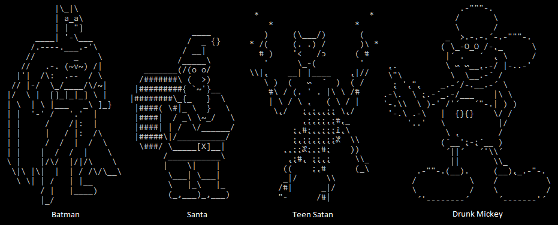
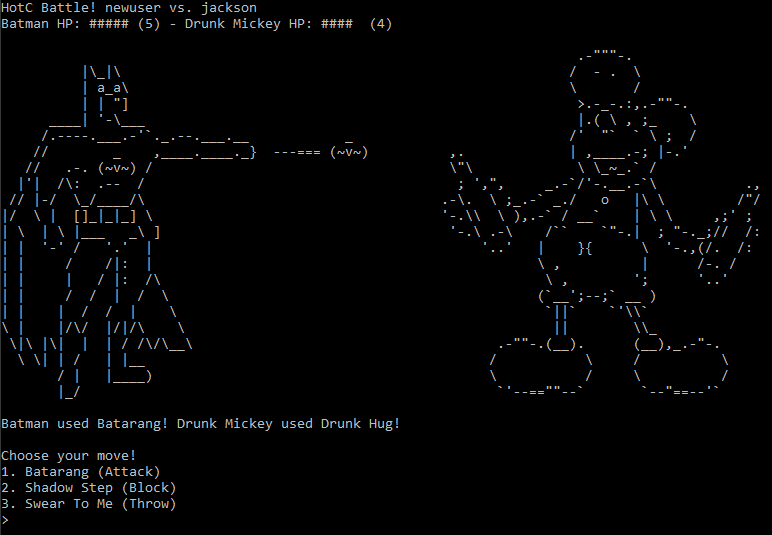

# Heroes of the Cubicles

This is a multiplayer LAN-based ASCII fighting game written in Python 2.7 that I made to kill productivity at work. **It should only be run on an internal network!** There is no encryption used for game communication, password storage, etc. Also, I take absolutely zero credit for any of the ASCII artwork, I found most of it on Christopher Johnson's [ASCII art website](http://www.chris.com/ascii/).

Features 4 playable characters! Who will you pick to dominate the cubicles?


Hop in and battle to the top of the highscores!


## Release Notes

**HotC Client v0.1 - 7/21/2017**
* First official release!
* Four playable characters, each with their own artwork and moves.
* Full multiplayer support with lobby and queue system.
* Login/register, highscores, users online query, and more.

## How to Play

To host your own server, clone this repository and start up a server like so:

```
$ git clone https://github.com/vesche/HotC
$ cd server/
$ python HotC_server.py
HotC server is listening on port 1337...

2017-10-31 16:42:44 - ? connected.
2017-10-31 16:43:01 - jackson logged in.
```

Have your friends connect to your server on Linux/macOS like so:
```
$ cd client/
$ python HotC_client.py --server <ip>
```

Or on Windows, download and extract [the latest HotC Windows client](/HotC_client_v0.1.zip):
```
$ HotC_client.exe --server <ip>
```
